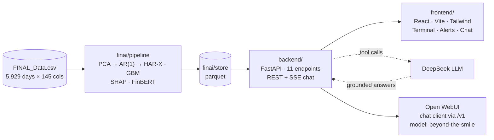

<div align="center">

# 📈 Beyond the Smile

### UBS Fin AI Bootcamp - CNY/CNH Volatility Intelligence

**Decomposing the USD/CNY & USD/CNH implied-volatility surface - beyond ATM, beyond the smile.**

[](https://github.com/nl2992/UBS_FinAI_BeyondTheSmile/actions)


*Two decades of vol-surface data → leakage-safe factor models → explainable forecasts → an AI research terminal that shows its work.*

</div>

---

## Live demo (GitHub Codespaces)

[](https://codespaces.new/nl2992/UBS_FinAI_BeyondTheSmile)

No local install needed - the full stack (FastAPI + React + model store) runs inside a Codespace in about 3 minutes.

**Steps:**

1. Fork (or use) the repo, then click **Code -> Codespaces -> Create codespace on main** (or the badge above).
2. **Add your `DEEPSEEK_API_KEY` as a Codespaces secret** before creating the Codespace (or rebuild after adding it):
   - GitHub -> Settings -> Secrets and variables -> Codespaces -> New repository secret
   - Name: `DEEPSEEK_API_KEY` | Value: your DeepSeek API key
   - Without the secret, every feature works except the streaming chat.
3. Wait for `postCreate` to finish (~3 min - it builds the vol model store for three CNH factors).
4. In the integrated terminal, run:
   ```bash
   bash scripts/codespace_start.sh
   ```
5. Codespaces will auto-forward port **5173**. Click **Open in Browser** (or the PORTS panel) and try the chat:

   > **"What drove CNH ATM vol on 2025-12-16?"**

The backend API is also reachable at the forwarded **:8000** port (`/docs` for the Swagger UI).

---

## What it does

Ask it a question like:

> **"What drove CNH ATM vol on 2025-12-16?"**

and the terminal streams back a grounded answer - realized RV **0.488** vs HAR-X forecast **0.538**, dominant SHAP driver **prior-week volatility (+1.08)**, with China onshore repo-rate changes and CSI 300 spillovers flagged in the GBM view. Every number is fetched live from the model store via tool calls; **the LLM cannot invent figures**.

Behind that sits a full research stack:

| | |
|---|---|
| 🧠 **Factor models** | PCA decomposition of the CNY & CNH vol surfaces (level / skew / curvature / tails), fit strictly in-sample |
| 📉 **Vol forecasting** | Rolling, no-lookahead **HAR-X**, **GARCH(1,1)**, **MIDAS-GARCH**, and **LightGBM** - benchmarked OOS with QLIKE & correlation vs naive baselines |
| 🔍 **Explainability** | **SHAP** on every rolling refit window - `TreeExplainer` for the GBM, `LinearExplainer` for HAR-X - per-date driver attribution + monthly stacked view |
| 📰 **News intelligence** | **FinBERT** sentiment scoring of curated CNY/CNH news, aligned to panel dates |
| 🚨 **Risk alerts** | LLM-written, UBS-style daily reports - generated *only* from structured model output |
| 💬 **Grounded chat** | Streaming DeepSeek assistant with tool-calling against the parquet store (SSE, token-by-token) |
| 🔌 **OpenAI-compatible API** | The grounded analyst is exposed at `/v1/chat/completions` as model `beyond-the-smile` - plug in **Open WebUI** or any OpenAI client |
| 📄 **Tear sheets** | One-click branded PDF per factor/model - chart, SHAP drivers, full model table |

## Architecture



**No look-ahead, anywhere.** IS/OOS split at 2019-12-31: PCA loadings, AR(1) de-meaning, scaling constants, and every rolling model fit use only information available at the time of the forecast.

## Quick start

```bash
# 1) environment
python3 -m venv ~/.venvs/beyond-the-smile
~/.venvs/beyond-the-smile/bin/pip install -r requirements.txt

# 2) secrets (never committed)
cp .env.example .env          # add your DEEPSEEK_API_KEY

# 3) everything, one command
./scripts/dev.sh              # add --with-openwebui for the chat client
```

→ **http://localhost:5173** - the terminal. **http://localhost:8000/docs** - the API.

### 🐳 Docker

```bash
echo "DEEPSEEK_API_KEY=sk-..." > .env
docker compose up --build     # terminal at http://localhost:8080
```

The backend image bakes the entire model store at build time - containers start instantly. The nginx layer proxies `/api` with SSE-safe streaming. No keys are ever baked into images. The compose stack also starts **Open WebUI at http://localhost:3000**, pre-wired to the `beyond-the-smile` model (auth disabled for demo).

### 💬 Open WebUI chat client

The backend speaks the OpenAI Chat Completions protocol at `/v1`, so Open WebUI works out of the box:

```bash
# local (needs Python 3.11+): python3.11 -m venv ~/.venvs/openwebui && ~/.venvs/openwebui/bin/pip install open-webui
./scripts/dev.sh --with-openwebui     # Open WebUI at http://localhost:3000
```

The instance is branded "Beyond the Smile - UBS Fin AI Bootcamp" and defaults to the `beyond-the-smile` model - every answer is tool-grounded in the parquet store, with a "consulting data store" progress line streamed while it queries. For the fully UBS-styled experience, use the React terminal; Open WebUI adds chat history, multi-turn threads, and prompt management on top of the same grounded analyst.

## The terminal

| Page | What you get |
|---|---|
| **Overview** | Branded landing - methodology walk-through + live OOS metrics |
| **Terminal** | Realized vs HAR-X vs GBM vol · OOS model league table · per-date SHAP drivers · monthly attribution stacks · **PDF tear-sheet export** |
| **Risk Alerts** | FinBERT sentiment strip · generated UBS-style daily reports |
| **Chat** | Streaming grounded Q&A - watch it consult the data store in real time |

## Engineering

- **55 automated tests** - 36 backend (every endpoint, incl. SSE frames + streaming-generator unit tests) + 19 frontend (SSE chunk-boundary parsing, typed error contract) - all gated in **GitHub Actions CI** on every push, which rebuilds the model store from raw data first.
- **API contract** - [docs/API_CONTRACT.md](docs/API_CONTRACT.md) is the single source of truth both halves build against.
- **Reproducible** - pinned CI deps ([requirements-ci.txt](requirements-ci.txt)), containerized runtime, deterministic pipeline (`python -m finai.pipeline.run_pipeline`).

## Repo map

```
finai/pipeline/   ingestion · PCA factors · vol models · SHAP · sentiment · alerts · CLI
finai/store/      parquet output store (rebuilt by the pipeline; gitignored)
finai/app/        shared data access + chat tool layer (+ legacy Streamlit UI)
backend/          FastAPI service (REST + SSE chat + /v1 OpenAI facade + PDF tear sheets)
frontend/         React terminal (Vite · TypeScript · Tailwind · recharts)
tests/            backend pytest suite
docs/             API contract
scripts/dev.sh    one-command dev environment
```

## Methodology notes

- **Surface blocks**: ATM (level, 2 PCs), 25Δ risk-reversal (skew), 25Δ butterfly (curvature), 10Δ RR/BF (tails) - per market, log-diff for ATM, level-diff for wings.
- **HAR-X**: forecasts log RV(t+1) from daily/weekly/monthly RV terms + ~40 macro exogenous drivers (repo rates, yields, DXY, VIX, equity & FX proxies), refit every 21 days on a 1,260-day window.
- **SHAP**: one explainer per refit window, so attribution always reflects the coefficients actually used for that forecast - persisted long-format for the API and chat tools.
- **Grounding discipline**: both the risk-alert generator and the chat assistant operate under "write only from this data" prompts, with the chat additionally forced through typed tool calls.

---

<div align="center">
<sub>Built for the UBS Fin AI Bootcamp · Author: <a href="https://github.com/nl2992">Nigel Li</a></sub>
</div>
